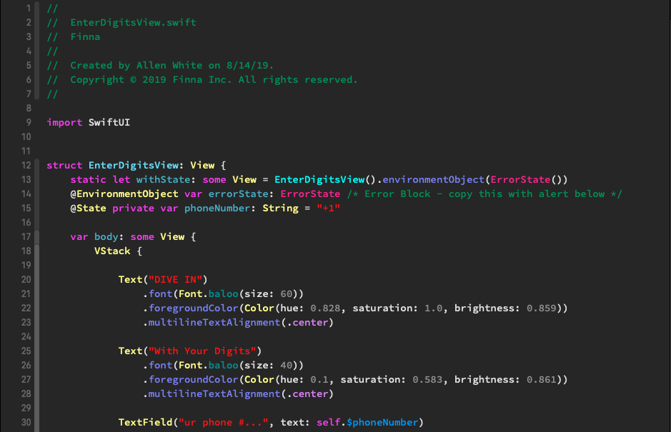

# Xcode-Colors
My color scheme for xcode.

Clone, and run 

`cp AlPal.xccolortheme Customized\ Dusk.xccolortheme Default\ \(Dark\).xccolortheme ~/Library/Developer/Xcode/UserData/FontAndColorThemes/`

To save to the following directory:
~/Library/Developer/Xcode/UserData/FontAndColorThemes/
